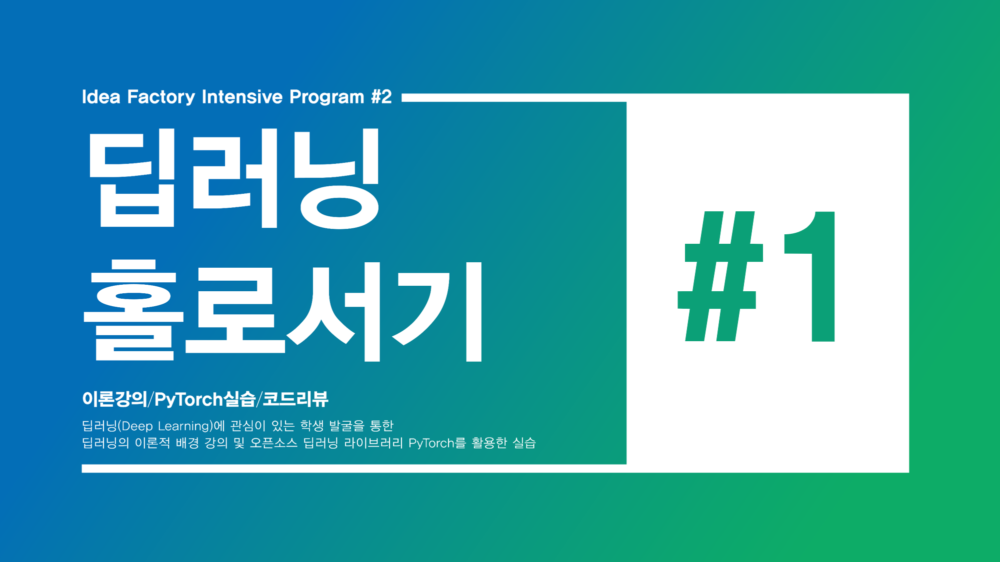

  

## 이 저장소를 활용하시는 모든 분들께 알리는 중요 공지사항 (2021.01.05)  

> 여러 랩 실습 코드 내에서 `optimizer.zero_grad()`가 매 iteration의 초반부에 호출되지 않고 Epoch 마다 한번씩만 실행되는 오류가 있었습니다. 해당 오류들은 모두 파악하여 trainloader 내에서 호출되도록 변경하였습니다. 오류 정정으로 강의 영상 상에서 보여지는 코드와 일부 달라질 수 있으나 본 저장소의 코드를 기준으로 강의를 수강해주시면 감사하겠습니다. (오류를 알려주신 @High-East님, 이준재님 감사드립니다.)

## Standalone-DeepLearning 
2019 KAIST 딥러닝 홀로서기 세미나용 저장소입니다.  

각 세미나는 3~4개의 강의 세션과 실습 세션들로 구성되어 있습니다.  
- 슬라이드를 원하시는 경우 `슬라이드` 링크를 통해 들어가신 후 우측 중간 쯤에 있는 `Download` 버튼을 누르시면 다운로드가 가능합니다.  
- 오프라인 세미나 영상 자료는 유튜브 채널 혹은 `비디오` 링크를 통해 확인하실 수 있습니다.  
- 실습 코드는 `실습 코드` 링크를 통해 들어가셔서 확인할 수 있으며 구글 콜라이보레이터를 통해서 직접 실행을 시키고 싶은 경우 실습 코드네 안내를 참고해주세요!  
- :bookmark_tabs:는 시작하기 전에 보면 좋은 자료, :pencil2:는 이론 강의, :bar_chart:는 실습 강의, :mortar_board:는 과제 그리고 :loudspeaker:는 각 회차에 대한 피드백을 남길 수 있는 설문 링크입니다!   

**만약 저희 세미나가 마음에 드셨다면 우측 상단에 있는 :star2:Star를 박아주세요! 미리 감사드리겠습니다!**  

## Contents  
#### Lec1 (01/17, Thur)  
딥러닝 홀로서기 세미나 오리엔테이션, Machine Learning Basic과 Linear Regression에 대한 내용을 다뤘습니다.  

:pencil2: Lec1-A(OT) / [슬라이드](https://github.com/heartcored98/Standalone-DeepLearning/blob/master/Lec1/Lec1-A.pdf) / [비디오](https://youtu.be/nHSCpxyAHx8)  

:pencil2: Lec1-B(Machine Learning Basic) / [슬라이드](https://github.com/heartcored98/Standalone-DeepLearning/blob/master/Lec1/Lec1-B.pdf) / [비디오](https://youtu.be/hPXeVHdIdmw)  

:pencil2: Lec1-C(Linear Regression) / 모두를 위한 머신러닝-딥러닝 강의 [슬라이드1](https://hunkim.github.io/ml/lec2.pdf), [슬라이드2](https://hunkim.github.io/ml/lec3.pdf), [슬라이드3](https://docs.google.com/presentation/d/1bHVxjCVvRKjCgtf6OMmxe35nR65LnsERoWSefWscv2I/) / [비디오](https://youtu.be/DWdtr_IURkU)

:bar_chart: Lab1(Linear Regression) / [실습 코드](https://github.com/heartcored98/Standalone-DeepLearning/blob/master/Lec1/Lab1_linear_regression.ipynb) / [비디오](https://youtu.be/nQqMT0wbthw)  

:loudspeaker: **1회차**를 즐기셨거나 혹은 어려웠다면 **피드백**을 남겨주세요! / [피드백 설문](https://goo.gl/forms/EjHD7zJ6lvmh9thB2) 

# 

#### Lec2 (01/21, Mon)  
Logistic Regression, Multi-Label Classification, Artificial Neural Network  

<시작 전에 보면 좋은 자료들>

:bookmark_tabs: Python Class를 잘 모르겠다 -> [점프 투 파이썬 - 클래스 편](https://wikidocs.net/28)  
:bookmark_tabs: Python 자료형을 잘 모르겠다(tuple, dictionary, set 등) -> [점프 투 파이썬 - 자료형 편](https://wikidocs.net/11)  
:bookmark_tabs: Numpy와 빠르게 익숙해지고 싶다 -> [김태완님 - Numpy CheatSheet](http://taewan.kim/post/numpy_cheat_sheet/)  
:bookmark_tabs: 다양한 변수들로 실험한 결과를 관리하고 시각화하고 싶다  -> [조재영 - Tox21 MLP](https://github.com/heartcored98/CH485_AI_Chemistry/blob/master/Practice4_logP_CNN/Assignment4_logP_CNN.ipynb)

:pencil2: Lec2-A / [슬라이드](https://github.com/heartcored98/Standalone-DeepLearning/blob/master/Lec2/Lec2-A_before_class.pdf) / [비디오](https://youtu.be/is_Vw-aJMg4)  

:pencil2: Lec2-B / [슬라이드](https://github.com/heartcored98/Standalone-DeepLearning/blob/master/Lec2/Lec2-B_before_class.pdf) / [비디오](https://youtu.be/oOQCrm4Vemo)  

:pencil2: Lec2-C / [슬라이드](https://github.com/heartcored98/Standalone-DeepLearning/blob/master/Lec2/Lec2-C_before_class.pdf) / [비디오](https://youtu.be/oOQCrm4Vemo?t=719)  

:bar_chart: Lab2(Pytorch Regression) / [실습 코드](https://github.com/heartcored98/Standalone-DeepLearning/blob/master/Lec2/Lab2_pytorch_regression_demo.ipynb) / [비디오1](https://youtu.be/-hWgqTB09DM), [비디오2](https://youtu.be/keQ59-RHnJE)   

:bar_chart: Lab3(Pytorch Classification) / [실습 코드](https://github.com/heartcored98/Standalone-DeepLearning/blob/master/Lec2/Lab3_pytorch_classification_demo.ipynb) / [비디오](https://youtu.be/_zbSlxz7ENI)

:mortar_board: Assignment1(Pytorch MNIST) / [시작 코드](https://github.com/heartcored98/Standalone-DeepLearning/blob/master/Lec2/Assignment1_pytorch_MNIST_MLP.ipynb) / [설명 비디오](https://youtu.be/keQ59-RHnJE?t=644) /   
 &nbsp;&nbsp;&nbsp;&nbsp;&nbsp;&nbsp;[피드백 및 과제 제출용 설문](https://goo.gl/forms/znUwZOIHyAtrw2jG3) / (**Due: 2019.01.23(Wed) 22:00**)  

:loudspeaker: **2회차**를 즐기셨거나 혹은 어려웠다면 **피드백**을 남겨주세요! / [피드백 설문](https://goo.gl/forms/znUwZOIHyAtrw2jG3)    

#  

#### Lec3 (01/24, Thur)  
Model Capacity, Overfitting/Underfitting, Regularization 

<시작 전에 보면 좋은 자료들>

:bookmark_tabs: Train, Validation, Test 뭔가 헷갈린다?? -> [About Train, Validation and Test Sets in Machine Learning](https://towardsdatascience.com/train-validation-and-test-sets-72cb40cba9e7)  
:bookmark_tabs: Pandas 맛보기 -> [10 Minutes to Pandas](https://pandas.pydata.org/pandas-docs/stable/10min.html)  
:bookmark_tabs: 실험 결과 로깅을 위한 json 파일 포맷 이해하기 -> [JSON으로 작업하기](https://developer.mozilla.org/ko/docs/Learn/JavaScript/Objects/JSON)  
:bookmark_tabs: matplotlib보다 더 쩌는 시각화 라이브러리 -> [seaborn](https://seaborn.pydata.org/index.html)  

:pencil2: Lec3-A / [슬라이드](https://github.com/heartcored98/Standalone-DeepLearning/blob/master/Lec3/Lec3-A.pdf) / [비디오](https://youtu.be/5zOkE7IPhxc)  
  
:pencil2: Lec3-B / [슬라이드](https://github.com/heartcored98/Standalone-DeepLearning/blob/master/Lec3/Lec3-B.pdf) / [비디오](https://youtu.be/ssf49Ppvh8c)  
    
:pencil2: Lec3-C / [슬라이드](https://github.com/heartcored98/Standalone-DeepLearning/blob/master/Lec3/Lec3-C.pdf) / [비디오](https://youtu.be/4ZIw7wWFhZ8)  

:pencil2: Lec3-D / [슬라이드](https://github.com/heartcored98/Standalone-DeepLearning/blob/master/Lec3/Lec3-D.pdf) / [비디오](https://youtu.be/_sz3KTyB9Lk)  

:pencil2: Lec3-E / [슬라이드](https://github.com/heartcored98/Standalone-DeepLearning/blob/master/Lec3/Lec3-E.pdf) / [비디오](https://youtu.be/-i8b-srMhGM)  

:bar_chart: Lab4(Pretty Code) / [실습 코드](https://github.com/heartcored98/Standalone-DeepLearning/blob/master/Lec3/Lab4_write_pretty_DL_code.ipynb) / [비디오](https://youtu.be/lh2Ed-b5l28)  

:mortar_board: Assignment2(Cifar10 Hyperparameter Tuning) / [시작 코드](https://github.com/heartcored98/Standalone-DeepLearning/blob/master/Lec3/Lab4_write_pretty_DL_code.ipynb) / [설명 비디오](https://youtu.be/lh2Ed-b5l28) /  
&nbsp;&nbsp;&nbsp;&nbsp;&nbsp;&nbsp;[피드백 및 과제 제출용 설문](https://goo.gl/forms/2bTUJdyzHTEFxFth1) / (**Due: 2019.01.27(Sun) 22:00**)    

:loudspeaker: **3회차**를 즐기셨거나 혹은 어려웠다면 **피드백**을 남겨주세요! / [피드백 설문](https://goo.gl/forms/2bTUJdyzHTEFxFth1)    

#  

#### Lec4 (01/28, Mon)  
Optimizer, Visualize 5 dimension Data with Pandas & Seaborn  

:pencil2: Lec4-A(with Lab5) / [슬라이드](https://github.com/heartcored98/Standalone-DeepLearning/blob/master/Lec4/Lec4-A.pdf) / [실습 코드](https://github.com/heartcored98/Standalone-DeepLearning/blob/master/Lec4/Lab5_regularization_implemented.ipynb) / [비디오](https://youtu.be/qx9uglq80Qs)  

:pencil2: Lec4-B / [슬라이드](https://github.com/heartcored98/Standalone-DeepLearning/blob/master/Lec4/Lec4-B.pdf) / [비디오](https://youtu.be/a5R4gL1ObP8)    

:bar_chart: Lab6 / [슬라이드](https://github.com/heartcored98/Standalone-DeepLearning/blob/master/Lec4/Lec4-C.pdf) / [실습 코드](https://github.com/heartcored98/Standalone-DeepLearning/blob/master/Lec4/Lab6_result_report.ipynb) / [비디오](https://youtu.be/7CMxgqvrDgg)  

:mortar_board: Assignment3(Again, Cifar10 Hyperparameter Tuning) / [시작 코드](https://github.com/heartcored98/Standalone-DeepLearning/blob/master/Lec4/Assignment3_cifar10_MLP.ipynb) /  
&nbsp;&nbsp;&nbsp;&nbsp;&nbsp;&nbsp;[피드백 및 과제 제출용 설문](https://goo.gl/forms/XQHdElHCueyCwfoi2) / (**Due: 2019.01.30(Wed) 22:00**)  

:loudspeaker: **4회차**를 즐기셨거나 혹은 어려웠다면 **피드백**을 남겨주세요! / [피드백 설문](https://goo.gl/forms/XQHdElHCueyCwfoi2)    

#
    
#### Lec5 (01/31, Thur)

Basic of Convolutional Neural Network (CNN)

:pencil2: Lec5-A (Review of assignment #3) / [과제 코드](https://github.com/heartcored98/Standalone-DeepLearning/blob/master/Lec4/Assignment3_cifar10_MLP.ipynb) / [비디오](https://www.youtube.com/watch?v=NPcQ_SdSDN0&t=5s)

:pencil2: Lec5-B / [슬라이드](https://github.com/heartcored98/Standalone-DeepLearning/blob/master/Lec5/Lec5-A.pdf) / [비디오](https://www.youtube.com/watch?v=PIft4URoQcw)

:bar_chart: Lab7 / [실습 코드](https://github.com/heartcored98/Standalone-DeepLearning/blob/master/Lec5/Lab7_CIFAR-10_with_CNN.ipynb) / [비디오](https://www.youtube.com/watch?v=uskpN90u-dE)

:mortar_board: Assignment4(CIFAR-10 classification with CNN) / [시작코드]() / [피드백 및 과제 제출용 설문](https://goo.gl/forms/32IOKOodoBjY63VO2) / (**Due: 2019.02.06(Wed) 22:00**)

:loudspeaker: **5회차**를 즐기셨거나 혹은 어려웠다면 **피드백**을 남겨주세요! / [피드백 설문](https://goo.gl/forms/32IOKOodoBjY63VO2)

#
    
#### Lec6 (02/07, Thur)

Advanced CNN Architectures (Skip-connection, Inception, ResNet)

:pencil2: Lec6-A (Review of assignment #4) / [과제 코드](https://github.com/heartcored98/Standalone-DeepLearning/blob/master/Lec5/Assignment4_CIFAR-10_with_CNN.ipynb) / [비디오](https://www.youtube.com/watch?v=fPibzxr6LdQ&t=17s)

:pencil2: Lec6-B / [슬라이드](https://github.com/heartcored98/Standalone-DeepLearning/blob/master/Lec6/Lec6-A.pdf) / [비디오](https://www.youtube.com/watch?v=8mI9zRdx2Es)

:bar_chart: Lab8 / [실습 코드](https://github.com/heartcored98/Standalone-DeepLearning/blob/master/Lec6/Lab8_CIFAR_100_with_ResNet.ipynb) / [비디오](https://www.youtube.com/watch?v=Fh3vxJNoREA)

:mortar_board: Assignment5(CIFAR-100 classification with ResNet) / [시작코드](https://github.com/heartcored98/Standalone-DeepLearning/blob/master/Lec6/Assignment5_CIFAR-100_with_ResNet.ipynb) / [피드백 및 과제 제출용 설문](https://goo.gl/forms/awJO5Sk1fKCT82mY2) / (**Due: 2019.02.010(Sun) 22:00**)

:loudspeaker: **6회차**를 즐기셨거나 혹은 어려웠다면 **피드백** 남겨주세요! / [피드백 설문](https://goo.gl/forms/awJO5Sk1fKCT82mY2)

#  
 
#### Lec7 (02/11, Mon)  
 
Basic of Recurrent Neural Network (RNN)  
  
:pencil2: Lec7-A (Review of assignment #5) / [과제 코드](https://github.com/heartcored98/Standalone-DeepLearning/blob/master/Lec6/Assignment5_CIFAR-100_with_ResNet.ipynb) / [비디오](https://www.youtube.com/watch?v=bPVQGnxbwr0)

:pencil2: Lec7-B / [슬라이드](https://github.com/heartcored98/Standalone-DeepLearning/blob/master/Lec7/Lec7-A.pdf) / [비디오](https://www.youtube.com/watch?v=bPRfnlG6dtU)

:bar_chart: Lab9 / [실습 코드](https://github.com/heartcored98/Standalone-DeepLearning/blob/master/Lec7/Lab9_learn_trigonometric_with_RNN.ipynb) / [비디오](https://youtu.be/tlyzfIYvMWE)

:loudspeaker: **7회차**를 즐기셨거나 혹은 어려웠다면 **피드백** 남겨주세요! / [피드백 설문](https://goo.gl/forms/oheopjRPfQGVjTLD3)

#  
 
#### Lec8 (02/14, Thur)   
 
Advanced RNN Architectures (LSTM, GRU)  

<시작 전에 보면 좋은 자료들>

:bookmark_tabs: LSTM을 시각적으로 쉽게 이해하고 싶다면 -> [Understanding LSTM Networks - Colah's Blog](http://colah.github.io/posts/2015-08-Understanding-LSTMs/)    
:bookmark_tabs: pytorch에서 나만의 데이터셋을 만들려면? -> [Data Loading Tutorial - Pytorch Official Tutorial](https://pytorch.org/tutorials/beginner/data_loading_tutorial.html)  
:bookmark_tabs: LSTM을 pytorch에서 정확하게 쓰려면? -> [LSTM for time series in pytorch - Jessica's Blog](http://www.jessicayung.com/lstms-for-time-series-in-pytorch/)    

:pencil2: Lec8-A / [슬라이드](https://github.com/heartcored98/Standalone-DeepLearning/blob/master/Lec8/Lec8-A.pdf) / [비디오](https://youtu.be/cs3tSnAsyRs)

:bar_chart: Lab10 / [실습 코드](https://github.com/heartcored98/Standalone-DeepLearning/blob/master/Lec8/Lab10_Stock_Price_Prediction_with_LSTM.ipynb) / [비디오]()  

:loudspeaker: **8회차**를 즐기셨거나 혹은 어려웠다면 **피드백** 남겨주세요! / [피드백 설문](https://goo.gl/forms/a7gbaxIvYUOTue1T2)

#  
 
#### Lec9 (02/18, Mon)   
 
Basic of Graph Convolutional Network (GCN)  

<시작 전에 보면 좋은 자료들>

:bookmark_tabs: GCN을 찬찬히 제대로 다시 공부하고 싶다면? -> [Graph Convolutional Networks - Thomas's Blog](https://tkipf.github.io/graph-convolutional-networks/)    
:bookmark_tabs: 분자 데이터를 쉽게 다룰 수 있는 RDkit 라이브러리를 더 알고 싶다면? -> [Practice RDkit - Seongok's Jupyter Notebook](https://github.com/SeongokRyu/CH485---Artificial-Intelligence-and-Chemistry/blob/master/Practice%2002/practice_rdkit.ipynb)    

:pencil2: Lec9-A / [슬라이드](https://github.com/heartcored98/Standalone-DeepLearning/blob/master/Lec9/Lec9-A.pdf) / [비디오](https://www.youtube.com/watch?v=YL1jGgcY78U)

:bar_chart: Lab11 / [실습 코드](https://github.com/heartcored98/Standalone-DeepLearning/blob/master/Lec9/Lab11_logP_Prediction_with_GCN.ipynb) / [비디오](https://www.youtube.com/watch?v=htTt4iPJqMg)  

:loudspeaker: **9회차**를 즐기셨거나 혹은 어려웠다면 **피드백** 남겨주세요! / [피드백 설문](https://goo.gl/forms/09g6VmE4tdIQAi8E3)

#  
 
#### Lec10 (02/21, Thur)   
 
Generative Model: VAE and GAN

<시작 전에 보면 좋은 자료들>

:bookmark_tabs: Maximum Likelihood에 대해 궁금하다면? -> [Probability vs Likelihood](http://rpubs.com/Statdoc/204928)    

:pencil2: Lec10-A / [슬라이드](https://github.com/heartcored98/Standalone-DeepLearning/blob/master/Lec10/Lec10-A.pdf) / [비디오](https://www.youtube.com/watch?v=54hyK1J4wTc)  

:pencil2: Lec10-B / [슬라이드](https://github.com/heartcored98/Standalone-DeepLearning/blob/master/Lec10/Lec10-A.pdf) / [비디오](https://www.youtube.com/watch?v=LeMnE1TIil4)  

:pencil2: Lec10-C / [슬라이드](https://github.com/heartcored98/Standalone-DeepLearning/blob/master/Lec10/Lec10-A.pdf) / [비디오](https://www.youtube.com/watch?v=JOjMk-E1CnQ)  
  
:loudspeaker: **10회차**를 즐기셨거나 혹은 어려웠다면 **피드백** 남겨주세요! / [피드백 설문](https://goo.gl/forms/QZtWwQwTYsfAd6zA2)  

# Course Review  

**저희 세미나와 함께 해주셨던 분들이 남겨주신 최종 피드백입니다.**    

> 어려운 내용도 쉽게 설명해주시려 했던점, 항상 매 강의마다 피드백을 받고 개선하시려던 모습, 어려운부분/궁금한 점은 없는지 한 학생 한학생 신경쓰시면서 수업 진행해주셔서 감사했습니다. 덕분에 딥러닝에 대해 자세히 공부할 수있는 시간이었고, 무엇보다도 가장 좋았던 것은 이론과 함께 실제 코드에서는 어떻게 사용되는지 실습까지 함께 이루어져서 좋았습니다. 한달동안 강사분들 너무 수고하셨어요~  

 
-문화기술대학원 석사과정 수강생

#  

> 혼자서 어떻게 딥러닝에 대해 알아야되나 고민을 했는데 해결이 조금 된것 같습니다. 좋은 강의 잘 들었습니다!  

 
-생명과학과 석사과정 수강생

#  

> 파이썬에 대한 기초 지식없이 수강 신청부터 해버려서 진도를 따라감에 있어서 다소 어려움이 있었으나 강의 자체는 많은 도움이 되었습니다. 감사합니다~  

 
-기술경영학과 박사과정 수강생

  
#  

> 강의하시느라 고생이 많으셨습니다. 중간부터는 제가 박사과정학생인 관계로 참석을 하지 못해서 죄송할 뿐입니다. 유익한 수업 덕분에 많은 것들을 배워갑니다.  

 
-생명화학공학과 박사과정 수강생

  
#  

> 수업 시간에 실습을 하는 수업을 처음 들어봤는데 장단점이 모두 있었습니다. 일단 코딩을 시작한지 얼마 안된 입장에서는 이미 완벽하게 짠 코드를 보고 할 때보다 코드 한줄 한줄이 어떤 순서로 왜 들어갔는지 이해하기 좋았고, 문제가 생겼을 때 디버깅/트러블슈팅을 어떻게 하는지 알 수 있어 특히 유용했습니다! 동시에 그만큼 코딩이 익숙하지 않은 사람은 후반부 수업에서는 '이미 프로그래밍을 어느 정도 해본 선생님들의 코딩 방식+오늘 배운 개념+이전에 짠 코드를 바탕으로 추가되는 모듈'을 따라가는 것이 조금 버겁게 느껴질 때가 있었네요. 하지만 좀 버거워도 지금 이렇게 수업을 듣고 코딩을 해본 것이, 당장은 이해가 안되도 매번 MNIST, CIFAR 같은 쉬운 데이터셋만 다루는 것보다 나중에 참고해서 공부하면 장기적으로 더 좋겠다는 생각도 듭니다! 
이론 수업은 제가 이전에 몇 번 공부를 하기도 했고, 또 너무 수학적으로 치우치지 않으면서도 대충 용어만 설명하지 않고 도출 과정의 논리를 말씀해주셔서 알맞게 좋았습니다. 
잠도 제대로 못자고 수업 준비 하고, 무려 라이브코딩과 과제리뷰(나중엔 거의 못냈지만 다 시도는 해보았습니다)까지 어마무시한 수업 준비하고 강의해주신 것 다시 한 번 정말 감사드립니다!   

 
-문화기술대학원 석사과정 수강생

#  

> 여건을 고려하면 아주 훌륭한 강의였습니다! 특히 두 분의 강의력에 매번 감탄하며 수업을 들었던 기억이 나네요 :) 
현실적으로 가능하다면 추후에는 좀 더 다양한 real world problem case에 대해 실습을 진행하면 좋지 않을까 싶네요ㅎㅎ 덕분에 겨울방학을 보람차게 보낼 수 있었습니다. 강의 진행하신 두 분, 그리고 이 강의에 도움 주신 모든 분들께 감사드립니다☺️

 
-화학과 학사과정 수강생

 

#  

> 코딩을 직접보고 어떻게 작성하는지 그 과정을 지켜보는 것도 흥미로왔고 짜여져 있는 코드를 내 상황에 맞는 변수로 수정해서 작동해 보며 프로그래밍에 훨씬 친숙해지는 계기가되어 좋았음
애쓰셨습니다.  

 
-투자정보과 박사과정 수강생

  
  

## 만든이 

조재영(Kevin Jo)1,2,3, 김승수(SeungSu Kim)1,2,3  

1 현재는 오토피디아에서 차량문제 해결 서비스, 닥터차를 만들고 있어요!  
2 딩브로 주식회사  
3 KAIST  

> 오토피디아는 지금 채용 중!  
> [> 포지션 살펴보기](https://career.doctor-cha.com/?utm_source=github&utm_medium=social&utm_campaign=%EB%94%A5%EB%9F%AC%EB%8B%9D%ED%99%80%EB%A1%9C%EC%84%9C%EA%B8%B0)  
